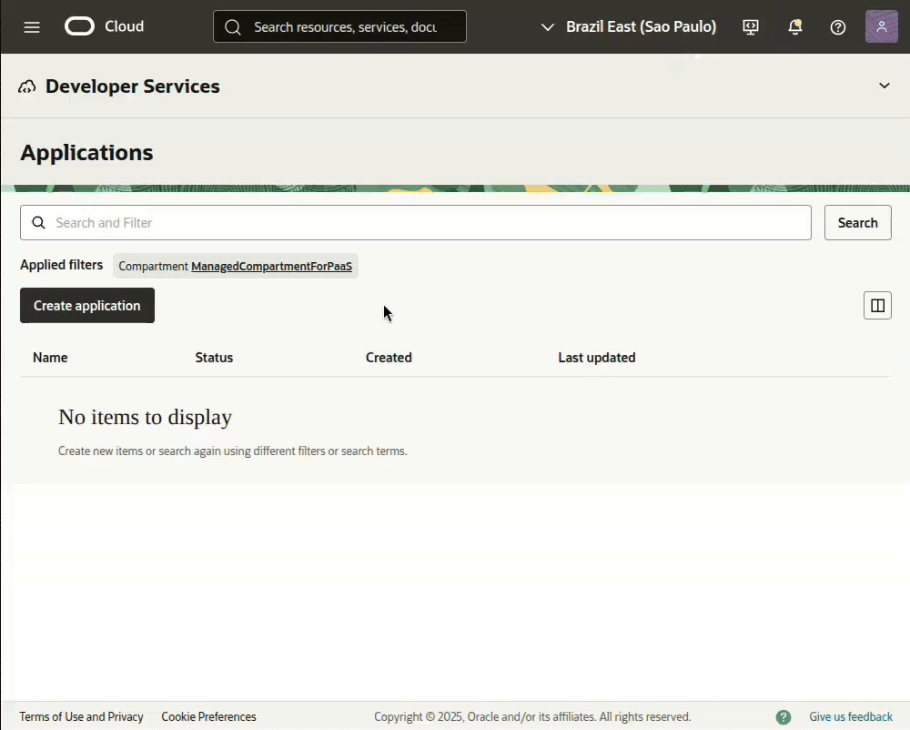
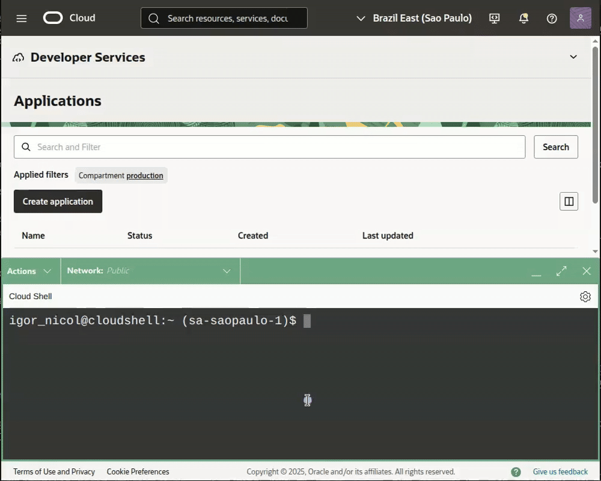

<h1> OCI Function: FinOps - Focus Report Extractor </h1>

[View this README in English](./README_en.md)

Este conjunto de arquivos contém uma **Function** em Python desenvolvida para automatizar o processo de *download* e *upload* dos relatórios no padrão [**FOCUS**](https://focus.finops.org/) da sua *Tenancy* OCI para um *bucket* dentro da mesma *tenancy*.

<h3> Isenção de responsabilidade </h3>

Antes de prosseguir, é fundamental ter em mente que a utilização de quaisquer *scripts*, códigos ou comandos contidos neste repositório é de sua total responsabilidade. Os autores dos códigos não se responsabilizam por quaisquer ônus decorrentes do uso do conteúdo aqui disponibilizado.

**Recomendamos testar** todo o conteúdo em um ambiente apropriado e integrar os *scripts* de automação a uma infraestrutura de monitoramento robusta, a fim de acompanhar o funcionamento do processo e mitigar possíveis falhas.

Este projeto **não é um aplicativo oficial da Oracle** e, portanto, não possui suporte formal. A Oracle não se responsabiliza por nenhum conteúdo aqui presente.

<h2> Visão geral </h2>

<h3>Index</h3>

- [Arquivos](#arquivos)
- [Abra o Cloud Shell](#abra-o-cloud-shell)
  - [Altere o Cloud Shell para usar a arquitetura X86\_64](#altere-o-cloud-shell-para-usar-a-arquitetura-x86_64)
  - [Crie as variaveis de ambiente no Cloud Shell:](#crie-as-variaveis-de-ambiente-no-cloud-shell)
- [Crie o FN Application para a arquitetura x86](#crie-o-fn-application-para-a-arquitetura-x86)
- [OCI Functions: Context](#oci-functions-context)
- [Container Registry](#container-registry)
- [Diretório de Trabalho](#diretório-de-trabalho)
- [Arquivos: requirements.txt e func.yaml](#arquivos-requirementstxt-e-funcyaml)
- [Upload: func.py](#upload-funcpy)
- [Execute o build da function:](#execute-o-build-da-function)
- [Function: Configuration](#function-configuration)
- [Bucket](#bucket)
- [Dynamic Group](#dynamic-group)
- [Policy](#policy)
- [Para testar a function](#para-testar-a-function)
- [Resource Scheduler](#resource-scheduler)
  - [Dynamic Group](#dynamic-group-1)
  - [Policy](#policy-1)
- [Habilitar o Log](#habilitar-o-log)


## Arquivos

A seguir estão os arquivos que compõem o projeto. Apenas três são essenciais; o `readme.md` pode ser ignorado no processo de implantação.

```
.
├── readme.md
├── func.py
├── func.yaml
└── requirements.txt
```

| Item | Descrição |
|------|-----------|
|readme.md|Este arquivo de documentação e auxílio.|
|**func.py**|O *script* em Python que será executado pela *function*.|
|**func.yaml**|O arquivo de configurações e características para a criação da *function*.|
|**requirements.txt**|A lista de módulos Python necessários para a execução do *script* `func.py`.|

## Abra o Cloud Shell



### Altere o Cloud Shell para usar a arquitetura X86_64


**Valide a arquitetura** com o comando abaixo. O retorno esperado é "x86\_64:OK" para a configuração correta.

```BASH
[ "$(uname -m)" == "x86_64" ] && echo "$(uname -m):OK" || echo "$(uname -m):ERRO"
```

### Crie as variaveis de ambiente no Cloud Shell:

Verifique se todas as variáveis foram configuradas corretamente.

```BASH
export OCI_USERNAME='igor.nicoli@gmail.com'
export OCI_DOMAIN_NAME='Default'
export FN_APP_NAME="FinOps"
export FN_FUNC_NAME="focus-report-extractor"
export OCI_REPO_NAME="${FN_APP_NAME,,}_${FN_FUNC_NAME}"
export OCI_BUCKET_NAME_DESTINATION="FinOps-Billing-Report"
export OCI_NAMESPACE=$(oci os ns get --raw-output --query 'data')
export OCI_COMPARTMENT="ocid1.compartment.oc1..aaaaaaaa7svbe2mrmcrmuaurzwup6dhs3xoer6jolwkgeu7fl4wxlnezwwba"
export OCI_SUBNET='ocid1.subnet.oc1.sa-saopaulo-1.aaaaaaaaurzsjuy6sl53cjqrj3hvfxh27utses6zar6s7wrw2rb4whphjuna'

set|grep -E '^(FN_APP_NAME|FN_FUNC_NAME|OCI_REPO_NAME|OCI_NAMESPACE|OCI_COMPARTMENT|OCI_DOMAIN_NAME|OCI_USERNAME|OCI_REGION)'
```

| Variavel | Descricao |
|-|-|
|**OCI_USERNAME** |Nome do usuário a ser utilizado para a autenticação no OCI Registry.|
|**OCI_DOMAIN_NAME** |Nome do domínio no qual o usuário utilizado está criado.|
|**FN_APP_NAME** |Nome da Application onde as functions serão criadas.|
|**FN_FUNC_NAME** |Nome da Function. Aceita apenas caracteres minúsculos.|
|**OCI_REPO_NAME** |Nome do repositório no OCI Registry para armazenar as imagens da function.|
|**OCI_NAMESPACE** |Nome do namespace do Object Storage da Tenancy OCI.|
|**OCI_COMPARTMENT** |OCID do compartment onde todos os recursos (FN App, FN Function, OCI Registry, etc.) serão criados.|
|**OCI_SUBNET** |OCID da subnet na qual a function será criada.|

Além dessas, serão utilizadas outras variáveis que já são previamente definidas no Cloud Shell:

| Variavel | Descricao |
|-|-|
| **OCI_REGION** |Nome completo da região na qual o Cloud Shell está conectado.|
| **OCI_TENANCY** |OCID da Tenancy OCI à qual estamos logados no Cloud Shell.|

## Crie o FN Application para a arquitetura x86

Crie uma **FN Application** para hospedar a function. Se já possuir uma, exporte o OCID para a variável de ambiente _FN_APP_OCID_ e o nome para _FN_APP_NAME_ para facilitar o uso posterior.

Para criar a application, utilize o comando abaixo, que já exporta o OCID para a variável.

```BASH
export FN_APP_OCID=$(oci fn application create \
--display-name ${FN_APP_NAME} \
--compartment-id ${OCI_COMPARTMENT} \
--subnet-ids "[\"${OCI_SUBNET}\"]" \
--shape "GENERIC_X86" \
--raw-output \
--query 'data.id')

set | grep -E '^(FN_APP_OCID)'
```

## OCI Functions: Context

```BASH
fn use context ${OCI_REGION}
fn update context oracle.compartment-id ${OCI_COMPARTMENT}
fn update context registry ${OCI_REGION}.ocir.io/${OCI_NAMESPACE}/${OCI_REPO_NAME}
fn update context oracle.image-compartment-id ${OCI_COMPARTMENT}
fn list context
```

## Container Registry

**É fundamental utilizar um Auth Token como senha** durante o processo de _login_ no _OCI Container Registry_.

Caso você não possua um *Auth Token* criado, gere um novo utilizando o seguinte comando:

```BASH
oci iam auth-token create \
--user-id ${OCI_CS_USER_OCID} \
--description "OCI Container Registry" \
--raw-output \
--query 'data.token'
```

Este é o comando para efetuar o _login_ no **OCI Container Registry**:

```BASH
docker login -u "${OCI_NAMESPACE}/${OCI_DOMAIN_NAME}/${OCI_USERNAME}" ${OCI_REGION}.ocir.io
```

## Diretório de Trabalho

```BASH
mkdir -p ~/oci-functions/${FN_FUNC_NAME}
cd ~/oci-functions/${FN_FUNC_NAME}
```

## Arquivos: requirements.txt e func.yaml

Estes arquivos foram detalhados na seção [Arquivos](#arquivos).

```BASH
cat << EOF > requirements.txt
oci>=2.155
fdk
EOF
```

```BASH
cat << EOF > func.yaml
schema_version: 20180708
name: ${FN_FUNC_NAME}
version: 0.0.1
runtime: python
entrypoint: /python/bin/fdk /function/func.py handler
memory: 128
timeout: 300
EOF
```

## Upload: func.py



Após realizar o upload utilizando o botão no canto superior direito, mova o arquivo para o diretório de trabalho criado anteriormente.

```BASH
mv ~/func.py .
```

## Execute o build da function:

Este comando executa as seguintes etapas:

Cria a imagem da function com Python e todos os módulos listados em requirements.txt.

Cria o repositório no _OCI Container Registry_ para o upload da imagem.

Cria a function com as características definidas em func.yaml dentro da _FN Application_.

```BASH
fn --verbose deploy --app "${FN_APP_NAME}"
```

Após o build e o deploy da imagem da function serem concluídos com sucesso, é necessário obter o OCID da function para liberar seu acesso aos recursos necessários.

Execute o comando abaixo para consultar o OCID da function:

```BASH
export FN_FUNC_OCID=$(oci fn function list \
--application-id ${FN_APP_OCID} \
--raw-output \
--query "data[?contains(\"display-name\", '${FN_FUNC_NAME}')].id | [0]")

set | grep -E '^(FN_FUNC_OCID)'
```

## Function: Configuration

Para garantir a flexibilidade, a function utilizará variáveis configuradas para receber dados que podem ser diferentes em cada tenancy:

| Variavel | Descrição |
|----------|-----------|
|OCI_BUCKET_DESTINATION|O nome do Bucket que será utilizado para armazenar os arquivos FOCUS Report.|
|OCI_TENANCY_OCID|O **OCID** do Tenancy.|

```BASH
fn config function ${FN_APP_NAME} ${FN_FUNC_NAME} OCI_BUCKET_DESTINATION ${OCI_BUCKET_NAME_DESTINATION}
fn config function ${FN_APP_NAME} ${FN_FUNC_NAME} OCI_TENANCY_OCID ${OCI_TENANCY}
```

## Bucket

Este Bucket receberá todos os arquivos FOCUS Report que a function localizar disponíveis para a Tenancy.

```BASH
oci os bucket create --name ${OCI_BUCKET_NAME_DESTINATION} \
--storage-tier "STANDARD" \
--namespace-name ${OCI_NAMESPACE} \
--compartment-id ${OCI_COMPARTMENT}
```

## Dynamic Group

Para conceder as permissões necessárias para a function acessar os relatórios FOCUS e o bucket de destino, é essencial criar um grupo dinâmico conforme o comando abaixo:

```BASH
export DYG_NAME="DYG_${FN_APP_NAME}_${FN_FUNC_NAME}_Function"

oci iam dynamic-group create \
--name ${DYG_NAME} \
--description "Dynamic group para a function que extrai os relatorios FOCUS do billing." \
--matching-rule "ALL {resource.type = 'fnfunc', resource.id = '${FN_FUNC_OCID}'}"
```

A **matching-rule** deste _Dynamic Group_ selecionará exclusivamente a sua function, independentemente do compartment onde ela foi criada.

## Policy

Esta política de acesso liberará o acesso da function aos arquivos FOCUS e ao bucket de destino, utilizando o grupo dinâmico criado.

```BASH
cat <<EOF > /tmp/function_focus_report_extractor.policy
[
    "Define tenancy usage-report as ocid1.tenancy.oc1..aaaaaaaaned4fkpkisbwjlr56u7cj63lf3wffbilvqknstgtvzub7vhqkggq",
    "Endorse dynamic-group ${DYG_NAME} to read objects in tenancy usage-report",
    "Allow dynamic-group ${DYG_NAME} to manage objects in compartment id ${OCI_COMPARTMENT} where target.bucket.name='${OCI_BUCKET_NAME_DESTINATION}'",
    "Allow dynamic-group ${DYG_NAME} to manage buckets in compartment id ${OCI_COMPARTMENT} where target.bucket.name='${OCI_BUCKET_NAME_DESTINATION}'"
]
EOF

export POL_NAME="POL_${FN_APP_NAME}_${FN_FUNC_NAME}_Function"

oci iam policy create \
--name "${POL_NAME}" \
--description "Permissoes para a function que extrai os relatorios FOCUS do billing." \
--compartment-id ${OCI_TENANCY} \
--statements file:///tmp/function_focus_report_extractor.policy
```

Por conter uma regra de "[**endorse**](https://docs.oracle.com/en-us/iaas/database-tools/doc/cross-tenancy-policies.html)", esta política deve ser criada no compartment root (Tenancy) do ambiente.

## Para testar a function

Para verificar o funcionamento da function, utilize o comando abaixo:

```BASH
fn invoke ${FN_APP_NAME} ${FN_FUNC_NAME}
```

[!TIP]
Após concluir o processo de criação com sucesso, **aguarde alguns minutos**. Essa pausa é crucial para garantir que o sistema carregue e atualize os *caches* de permissões, especialmente as novas políticas concedidas à *function*.

## Resource Scheduler

Para a execução automatizada, utilizaremos o serviço PaaS de **Agendamento (Resource Scheduler)** do OCI.

O agendamento será configurado para **duas execuções diárias**:

- **00:00 UTC** (Meia-noite)
- **12:00 UTC** (Meio-dia)

Lembre-se de que o agendamento é configurado no fuso horário **UTC**. Caso sua região tenha um deslocamento de **-3 horas** em relação ao UTC (como o fuso horário de São Paulo, Brasil), ajuste os horários de execução conforme necessário.

```BASH
export CRON_SCHEDULER='0 3,15 * * *'

export RESOURCE_SCHEDULER_OCID=$(oci resource-scheduler schedule create \
--display-name "${FN_APP_NAME} - ${FN_FUNC_NAME}" \
--description "${FN_APP_NAME} - ${FN_FUNC_NAME} Scheduler" \
--compartment-id ${OCI_COMPARTMENT} \
--action "START_RESOURCE" \
--recurrence-details ${CRON_SCHEDULER} \
--recurrence-type "CRON" \
--resources "[{\"id\":\"${FN_FUNC_OCID}\",\"metadata\":null,\"parameters\":null}]" \
--raw-output \
--query 'data.id')

set | grep -E '^(RESOURCE_SCHEDULER_OCID)'
```

### Dynamic Group

De forma análoga à _Function_, é necessário criar um **Grupo Dinâmico (Dynamic Group)** específico para o nosso agendamento, conforme o comando abaixo:

```BASH
export DYG_RESOURCE_SCHEDULER="DYG_${FN_APP_NAME}_${FN_FUNC_NAME}_Scheduler"

oci iam dynamic-group create \
--name ${DYG_RESOURCE_SCHEDULER} \
--description "Dynamic group para o Resource Scheduler que vai executar a function que extrai os relatorios FOCUS do billing." \
--matching-rule "All {resource.type='resourceschedule', resource.id='${RESOURCE_SCHEDULER_OCID}'}"
```

A **matching-rule** deste _Dynamic Group_ selecionará exclusivamente o nosso agendamento, independentemente do compartment onde ela foi criada.

### Policy

Esta política de acesso concederá permissão ao agendamento para **invocar a nossa _function_**, utilizando o grupo dinâmico que será criado.

```BASH

export POL_RESOURCE_SCHEDULER="POL_${FN_APP_NAME}_${FN_FUNC_NAME}_Scheduler"

oci iam policy create \
--name "${POL_RESOURCE_SCHEDULER}" \
--description "Permissoes para a function que extrai os relatorios FOCUS do billing." \
--compartment-id ${OCI_COMPARTMENT} \
--statements "[\"Allow dynamic-group ${DYG_RESOURCE_SCHEDULER} to use functions-family in compartment id ${OCI_COMPARTMENT}\"]"
```

A política de acesso será criada no mesmo _compartment_ de todos os demais recursos, conforme definido pela variável `OCI_COMPARTMENT`.

## Habilitar o Log

Caso ocorram problemas ou erros, **ative o _log_ e acompanhe os eventos** para identificar e corrigir eventuais falhas.

[!IMPORTANT]
O **Log da _function_ não é habilitado por padrão**. É mandatório ativá-lo manualmente.
