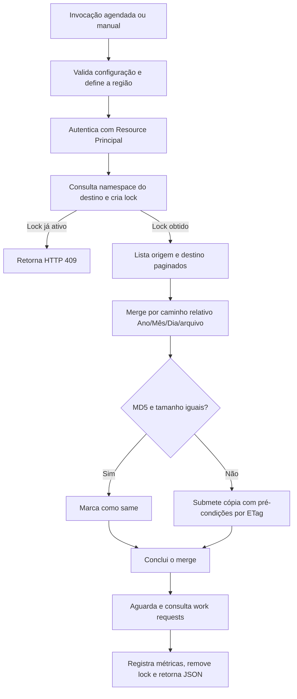

<h1> OCI Function: FinOps - Focus Report Extractor </h1>

[View this README in English](./readme_en-US.md) <span>&#127482;&#127480;</span>

Este conjunto de arquivos contém uma ***Function*** em Python desenvolvida para sincronizar relatórios no padrão [**FOCUS**](https://focus.finops.org/) da sua *Tenancy* OCI para um *bucket* dentro da mesma *tenancy*. A transferência é uma cópia direta entre buckets pelo Object Storage; os arquivos não são baixados para o ambiente da Function.

<h2> Isenção de responsabilidade </h2>

Antes de prosseguir, é fundamental ter em mente que a utilização de quaisquer *scripts*, códigos ou comandos contidos neste repositório é de sua total responsabilidade. Os autores dos códigos não se responsabilizam por quaisquer ônus decorrentes do uso do conteúdo aqui disponibilizado.

**Recomendamos testar** todo o conteúdo em um ambiente apropriado e integrar os *scripts* de automação a uma infraestrutura de monitoramento robusta, a fim de acompanhar o funcionamento do processo e mitigar possíveis falhas.

Este projeto **não é um aplicativo oficial da Oracle** e, portanto, não possui suporte formal. A Oracle não se responsabiliza por nenhum conteúdo aqui presente.

<h2> Visão geral </h2>

O *script* em Python, desenvolvido para execução no serviço *serverless* **OCI Functions**, lista os relatórios **FOCUS** no *bucket* público gerenciado pela OCI e usa cópias assíncronas do Object Storage para criar ou atualizar somente os objetos necessários no *bucket* de destino.

A estrutura de armazenamento no destino replica a hierarquia da origem: **Ano/Mês/Dia**.

Toda essa operação é orquestrada através de chamadas diretas à API do OCI, conforme detalhado abaixo:

- [**Object Storage**: `get_namespace`](https://docs.oracle.com/en-us/iaas/tools/python/latest/api/object_storage/client/oci.object_storage.ObjectStorageClient.html#oci.object_storage.ObjectStorageClient.get_namespace)
- [**Object Storage**: `list_objects`](https://docs.oracle.com/en-us/iaas/tools/python/latest/api/object_storage/client/oci.object_storage.ObjectStorageClient.html#oci.object_storage.ObjectStorageClient.list_objects)
- [**Object Storage**: `copy_object`](https://docs.oracle.com/en-us/iaas/tools/python/latest/api/object_storage/client/oci.object_storage.ObjectStorageClient.html#oci.object_storage.ObjectStorageClient.copy_object)
- [**Object Storage**: `put_object`, `head_object` e `delete_object`](https://docs.oracle.com/en-us/iaas/tools/python/latest/api/object_storage/client/oci.object_storage.ObjectStorageClient.html) para o lock de execução
- [**Object Storage**: `get_work_request`](https://docs.oracle.com/en-us/iaas/tools/python/latest/api/object_storage/client/oci.object_storage.ObjectStorageClient.html#oci.object_storage.ObjectStorageClient.get_work_request) para acompanhar as cópias submetidas

Para atualizar uma Function já implantada, consulte o [procedimento de atualização](./fn_update.md).

<h2>Índice</h2>

- [Requisitos](#requisitos)
  - [Permissões](#permissões)
  - [Redes](#redes)
- [Arquivos do projeto](#arquivos-do-projeto)
- [Cloud Shell](#cloud-shell)
  - [Arquitetura X86\_64](#arquitetura-x86_64)
  - [Variáveis de ​​ambientais](#variáveis-de-ambientais)
- [Diretório de Trabalho](#diretório-de-trabalho)
- [Clone o repositório Git](#clone-o-repositório-git)
- [OCI Container Registry](#oci-container-registry)
- [Bucket](#bucket)
- [OCI Function](#oci-function)
  - [OCI Function: Application](#oci-function-application)
  - [OCI Function: Context](#oci-function-context)
  - [OCI Function: Arquivos](#oci-function-arquivos)
    - [requirements.txt](#requirementstxt)
    - [func.yaml](#funcyaml)
    - [func.py](#funcpy)
  - [OCI Function: Build](#oci-function-build)
  - [OCI Function: Tagging](#oci-function-tagging)
  - [OCI Function: Dynamic Group](#oci-function-dynamic-group)
  - [OCI Function: Policy](#oci-function-policy)
- [Resource Scheduler](#resource-scheduler)
  - [Resource Scheduler: Critérios de Agendamento Dinâmico](#resource-scheduler-critérios-de-agendamento-dinâmico)
  - [Resource Scheduler: Dynamic Group](#resource-scheduler-dynamic-group)
  - [Resource Scheduler: Policy](#resource-scheduler-policy)
  - [Resource Scheduler: Utilizando o agendamento existente](#resource-scheduler-utilizando-o-agendamento-existente)
- [Testando](#testando)
- [Logging](#logging)

## Requisitos

Para dar continuidade a este procedimento, é necessário **cumprir os requisitos** a seguir:

### Permissões

As permissões são divididas em dois grupos de ações:

- **Para Criação de Recursos:**
  - Bucket
  - Grupo Dinâmico (*Dynamic Group*)
  - Política de Acesso IAM (*IAM Policy*)
  - Function
  - OCI Container Registry
  - Resource Scheduler

- **Para Acesso a Recursos:**
  - Cloud Shell
  - Relatórios de Custos e Uso (*Cost and Usage Reports*)

### Redes

É mandatório que você possua uma **VCN** criada com uma **Subnet** que tenha endereços IP disponíveis para alocar a *Function*. Essa *Subnet* deve possuir **acesso à internet** ou ter um **Gateway de Serviços** ativo.

<h2>Fluxo de execução</h2>


```mermaid
flowchart TD
    A[Invocação agendada ou manual] --> B[Valida configuração e define a região]
    B --> C[Autentica com Resource Principal]
    C --> D[Consulta namespace do destino e cria lock]
    D -->|Lock já ativo| E[Retorna HTTP 409]
    D -->|Lock obtido| F[Lista origem e destino paginados]
    F --> G[Merge por caminho relativo Ano/Mês/Dia/arquivo]
    G --> H{MD5 e tamanho iguais?}
    H -->|Sim| I[Marca como same]
    H -->|Não| J[Submete cópia com pré-condições por ETag]
    I --> K[Conclui o merge]
    J --> K
    K --> L[Aguarda e consulta work requests]
    L --> M[Registra métricas, remove lock e retorna JSON]
```

1. A Function lê `OCI_TENANCY_OCID`, `OCI_BUCKET_DESTINATION` e `OCI_BUCKET_ROOT_PATH`. A região de destino é `OCI_BUCKET_DESTINATION_REGION`, quando configurada; caso contrário, usa automaticamente `OCI_RESOURCE_PRINCIPAL_REGION`.
2. Com o Resource Principal, consulta uma vez o namespace do destino e cria `PREFIXO/.focus-report-exporter.lock`. Uma execução concorrente recebe HTTP `409`; um lock abandonado expira após 15 minutos.
3. A origem fixa é o namespace público `bling`, bucket igual ao OCID da tenancy e prefixo `FOCUS Reports/`. O destino usa o bucket e o prefixo configurados, normalmente `FOCUS-Reports/`. Assim, `FOCUS Reports/2026/07/26/arquivo.csv.gz` é comparado com `FOCUS-Reports/2026/07/26/arquivo.csv.gz`.
4. As duas listagens são paginadas e comparadas em ordem lexicográfica pelo caminho relativo. As páginas não precisam estar alinhadas e o código mantém apenas o objeto atual do destino em memória. A origem é listada integralmente para garantir a sincronização de todos os relatórios publicados.
5. Objetos com o mesmo MD5 e tamanho não são copiados. Para objetos ausentes ou divergentes, a cópia é submetida com ETag da origem e, quando já existe destino, com ETag do destino. Isso evita sobrescrever mudanças concorrentes.
6. Depois de submeter todas as cópias, a Function aguarda 5 segundos e consulta os *work requests* a cada 2 segundos, por no máximo 120 segundos. Ao final, registra as métricas, libera o lock e retorna o resultado em JSON.

## Arquivos do projeto

A seguir estão os arquivos que compõem o projeto. Apenas um arquivo é essencial; o `readme.md` e `readme_en-US.md` podem ser ignorados durante o processo de implantação.

```BASH
.
├── func.py
├── test_func.py
├── fn_update.md
├── fn_update_en-US.md
├── readme.md
└── readme_en-US.md
```

|Item|Descrição|
|----|---------|
|**func.py**|O *script* em Python que será executado pela *function*.|
|**test_func.py**|Testes unitários para validar a lógica da Function antes do *deploy*. Não é executado pela Function em produção.|
|fn_update.md|Procedimento para atualizar uma Function existente em português.|
|fn_update_en-US.md|Versão em inglês do procedimento de atualização.|
|readme.md|Este arquivo de documentação e auxílio.|
|readme_en-US.md|Versão em inglês deste arquivo de documentação e auxílio.|

## Cloud Shell

Para iniciar a criação e a configuração dos recursos, **abra o Cloud Shell**.


### Arquitetura X86\_64

Para o correto funcionamento dos recursos envolvidos neste procedimento, utilizaremos a **arquitetura x86\_64** como padrão.


**Valide a arquitetura** com o comando abaixo. O retorno esperado é "x86\_64:OK" para a configuração correta.

```BASH
[ "$(uname -m)" == "x86_64" ] && echo "$(uname -m):OK" || echo "$(uname -m):ERRO"
```

### Variáveis de ​​ambientais

Antes de criar as variáveis de ambiente, verifique se todas foram configuradas corretamente.

```BASH
export FN_APP_NAME="FinOps"
export FN_FUNC_NAME="Focus-Report-Extractor"
export FN_FUNC_TAG_VALUE='Scheduled-Function'
export OCI_DOMAIN_NAME='Default'
export OCI_BUCKET_NAME_DESTINATION="FinOps-Billing-Report"
export OCI_COMPARTMENT="ocid1.compartment.oc1..aaaaaaaa7_____1604"
export OCI_SUBNET='ocid1.subnet.oc1.<region>.aaaaaaaau_____1604'
export OCI_REPO_NAME="${FN_APP_NAME,,}_${FN_FUNC_NAME,,}"
export OCI_NAMESPACE=$(oci os ns get --raw-output --query 'data')
export OCI_BUCKET_ROOT_PATH='FOCUS-Reports'

export OCI_USERNAME=$(oci iam user get \
  --user-id "${OCI_CS_USER_OCID}" \
  --query 'data.name' \
  --raw-output)

set|grep -E '^(FN_APP_NAME|FN_FUNC_NAME|FN_FUNC_TAG_VALUE|OCI_DOMAIN_NAME|OCI_USERNAME|OCI_BUCKET_NAME_DESTINATION|OCI_COMPARTMENT|OCI_SUBNET|OCI_REPO_NAME|OCI_NAMESPACE|OCI_BUCKET_ROOT_PATH|OCI_REGION|OCI_TENANCY)'
```

|Variavel|Descricao|
|-|-|
|**FN_APP_NAME**|Nome da Application onde as functions serão criadas.|
|**FN_FUNC_NAME**|Nome da **OCI Function**.|
|**FN_FUNC_TAG_VALUE**|Valor utilizado para identificar a function que será executada pelo *Resource Scheduler*. A Key da *free-form Tag* sera o nome da Application da Function, definida na variável **FN_APP_NAME**.|
|**OCI_DOMAIN_NAME**|Nome do domínio no qual o usuário utilizado foi criado.|
|**OCI_USERNAME**|Nome do usuário a ser utilizado para a autenticação no **OCI Registry**. Este usuário será utilizado apenas durante o processo de configuração.|
|**OCI_BUCKET_NAME_DESTINATION**|Nome do **Bucket** que será utilizado para armazenar os arquivos extraidos pela **OCI Function**.|
|**OCI_COMPARTMENT**|OCID (*Oracle Cloud Identifier*) do ***compartment*** onde todos os recursos (Function Application, OCI Function, OCI Registry, etc.) serão criados.|
|**OCI_SUBNET**|OCID (*Oracle Cloud Identifier*) da ***subnet*** na qual a *function* será criada.|
|**OCI_REPO_NAME**|Nome do repositório no **OCI Registry** para armazenar as *images* da *function*.|
|**OCI_NAMESPACE**|Nome do *namespace* do **Object Storage** do Tenancy.|
|**OCI_BUCKET_ROOT_PATH**|Nome do **diretor raiz** do bucket de destino para os arquivos extraidos pela **OCI Function**.|

Além dessas, serão utilizadas outras variáveis que já são previamente definidas no OCI Cloud Shell:

| Variavel | Descricao |
|----------|-----------|
|**OCI_REGION**|Nome completo da região na qual o OCI Cloud Shell está conectado.|
|**OCI_TENANCY**|OCID (*Oracle Cloud Identifier*) do OCI Tenancy à qual estamos logados no OCI Cloud Shell.|

## Diretório de Trabalho

Vamos **criar um diretório de trabalho** para a organização de todos os nossos arquivos e, posteriormente, iniciar a **criação dos artefatos necessários** e o *build* da nossa *function*.

```BASH
mkdir -p ~/oci-functions/${FN_FUNC_NAME,,}
cd ~/oci-functions/${FN_FUNC_NAME,,}
```

## Clone o repositório Git

Efetue o clone desse repositorio git e/ou disponibilize todos os arquivos mencionandos no topico [Arquivos do projeto](#arquivos-do-projeto) em nosso diretorio de trabalho.

```BASH
git clone https://github.com/wuilber002/oci-functions.git
```

## OCI Container Registry

É necessário utilizar um **Auth Token como senha** durante o processo de *login* no **OCI Container Registry**.

Caso você não possua um *Auth Token* criado, gere um novo utilizando o seguinte comando:

```BASH
oci iam auth-token create \
--user-id ${OCI_CS_USER_OCID} \
--description "OCI Container Registry" \
--raw-output \
--query 'data.token'
```

Este é o comando para efetuar o *login* no **OCI Container Registry**:

> [!TIP]
> Caso você tenha acabado de criar o **Auth Token**, **aguarde alguns minutos** antes de utilizá-lo. Pode levar um tempo até que o *token* seja propagado e esteja pronto para efetuar *login* no OCI Container Registry.

```BASH
docker login -u "${OCI_NAMESPACE}/${OCI_DOMAIN_NAME}/${OCI_USERNAME}" ${OCI_REGION}.ocir.io
```

## Bucket

Este *Bucket* receberá todos os **relatorios FOCUS** extraidos para a *Tenancy*.

Caso você já possua o *Bucket* criado, você pode pular essa parte e fazer o export da variável **OCI_BUCKET_NAME_DESTINATION** com o nome do seu bucket. Caso contrario, crie o bucket com o mando abaixo:

```BASH
oci os bucket create --name ${OCI_BUCKET_NAME_DESTINATION} \
--storage-tier "STANDARD" \
--namespace-name ${OCI_NAMESPACE} \
--compartment-id ${OCI_COMPARTMENT}
```

## OCI Function

### OCI Function: Application

Crie uma **FN Application** com a arquitetura x86\_64 para hospedar a *function*. Se já possuir uma, *export* o OCID (*Oracle Cloud Identifier*) para a variável de ambiente ***FN_APP_OCID*** e o nome para ***FN_APP_NAME*** para facilitar o uso posterior.

Para criar a *application*, utilize o comando abaixo, que já exporta o OCID (*Oracle Cloud Identifier*) para uma variável de ambiente.

```BASH
export FN_APP_OCID=$(oci fn application create \
--display-name ${FN_APP_NAME} \
--compartment-id ${OCI_COMPARTMENT} \
--subnet-ids "[\"${OCI_SUBNET}\"]" \
--shape "GENERIC_X86" \
--raw-output \
--query 'data.id')

set | grep -E '^(FN_APP_OCID)'
```

### OCI Function: Context

É necessário realizar algumas **configurações de contexto** para o cliente `fn` do OCI Functions.

```BASH
fn use context ${OCI_REGION}
fn update context oracle.compartment-id ${OCI_COMPARTMENT}
fn update context registry ${OCI_REGION}.ocir.io/${OCI_NAMESPACE}/${OCI_REPO_NAME}
fn update context oracle.image-compartment-id ${OCI_COMPARTMENT}
fn list context
```

### OCI Function: Arquivos

Você precisar ter os arquivos abaixo em seu diretório de trabalho no Cloud Shell.

- `requirements.txt`
- `func.yaml`
- `func.py`

Pra criar os arquivos `func.yaml` e `requirements.txt`, você deve utilizar os comandos abaixo:

#### requirements.txt

Esse arquivo contem a lista de módulos Python necessários para a execução do *script* `func.py`.

```BASH
cat << EOF > requirements.txt
oci>=2.155
fdk
EOF
```

#### func.yaml

Arquivo de metadados com as configuração e características da *function* que sera criada.

```BASH
cat << EOF > func.yaml
schema_version: 20180708
name: ${FN_FUNC_NAME,,}
version: 0.0.1
runtime: python
entrypoint: /python/bin/fdk /function/func.py handler
memory: 128
timeout: 300
config:
 OCI_BUCKET_DESTINATION: ${OCI_BUCKET_NAME_DESTINATION}
 OCI_TENANCY_OCID: ${OCI_TENANCY}
 OCI_BUCKET_ROOT_PATH: ${OCI_BUCKET_ROOT_PATH}
 # Opcional: use somente se o bucket de destino estiver em outra região.
 # OCI_BUCKET_DESTINATION_REGION: us-ashburn-1
EOF
```

Para garantir a flexibilidade da solução, a *function* utilizará **variáveis** para receber dados que podem variar em cada *tenancy*. Abaixo a descrição de cada uma delas:

|Variavel|Descrição|
|--------|---------|
|OCI_BUCKET_DESTINATION|Nome do *Bucket* que será utilizado para **armazenar os arquivos extraídos pela OCI Function**.|
|OCI_TENANCY_OCID|O **OCID** (*Oracle Cloud Identifier*) da *Tenancy*.|
|OCI_BUCKET_ROOT_PATH|Nome da pasta "raiz" localizada no "Bucket" que ira receber os arquivos extraídos pela OCI Function.|
|OCI_BUCKET_DESTINATION_REGION|Opcional. Região do bucket de destino para cópias entre regiões. Se ausente, a Function usa automaticamente a região em que está em execução (`OCI_RESOURCE_PRINCIPAL_REGION`).|

> [!NOTE]
> A Function cria temporariamente o objeto `.focus-report-exporter.lock` dentro da pasta raiz configurada no bucket de destino. Ele evita cópias duplicadas quando há invocações concorrentes e é considerado expirado após 15 minutos caso uma execução seja interrompida.

> [!NOTE]
> A origem é listada integralmente para garantir a sincronização. Origem e destino são processados página a página; durante o merge, a Function retém no máximo o objeto atual do destino, e não um inventário completo do bucket.

#### func.py

O arquivo `func.py` precisa ser enviado (via *upload*), se você não fez o clone do repositório para o nosso **diretório de trabalho** (*work directory*).


Após realizar o upload utilizando o botão no canto superior direito, mova o arquivo para o **diretório de trabalho** (*work directory*) criado anteriormente.

```BASH
mv ~/func.py .
```

### OCI Function: Build

Antes do *deploy*, valide a integridade do código e dos testes unitários. O comando não requer credenciais OCI nem acessa buckets:

```BASH
python -m unittest -v
```

O resultado esperado é `OK`. Corrija qualquer falha antes de continuar o processo de publicação.

O próximo comando executará as seguintes etapas:

- Cria a *image* da *function* com Python e todos os módulos listados em `requirements.txt`;
- Cria o repositório no **OCI Container Registry** para o *upload* da *image*;
- Cria a *function* com as características definidas em `func.yaml` dentro da **Function Application**;
- Configura as variáveis de ambiente.

```BASH
fn --verbose deploy --app "${FN_APP_NAME}"
```

Após a conclusão bem-sucedida do *build* e do *deploy* da *image* da *function*, é necessário **obter o OCID** (*Oracle Cloud Identifier*) da *function* para liberar seu acesso aos recursos necessários.

Execute o comando abaixo para **consultar o OCID** (*Oracle Cloud Identifier*) da *function*:

```BASH
export FN_FUNC_OCID=$(oci fn function list \
--application-id ${FN_APP_OCID} \
--raw-output \
--query "data[?contains(\"display-name\", '${FN_FUNC_NAME,,}')].id | [0]")

set | grep -E '^(FN_FUNC_OCID)'
```

### OCI Function: Tagging

Para que o serviço **Resource Scheduler** consiga identificar e selecionar o recurso correto para execução agendada, é necessário **definir a Free-form Tag** específica na *function* criada.

O *Resource Scheduler* utilizará essa *tag* como um filtro de metadados para invocar o recurso.

Utilize o comando a seguir para aplicar a *tag* na *function*:

```BASH
oci fn function update \
--force \
--function-id ${FN_FUNC_OCID} \
--freeform-tags "{\"${FN_APP_NAME}\": \"${FN_FUNC_TAG_VALUE}\"}"
```

### OCI Function: Dynamic Group

Para **conceder as permissões** necessárias para a *function* acessar os relatórios FOCUS e o *bucket* de destino, é fundamental criar um **Grupo Dinâmico (Dynamic Group)**, conforme o comando abaixo:

```BASH
export DYG_FUNCTION="${FN_APP_NAME}_${FN_FUNC_NAME}"

oci iam dynamic-group create \
--name ${DYG_FUNCTION} \
--description "Dynamic group para a function que extrai os relatorios FOCUS do billing." \
--matching-rule "ALL {resource.type = 'fnfunc', resource.id = '${FN_FUNC_OCID}'}"
```

> [!NOTE]
A **`matching-rule`** deste **Grupo Dinâmico** selecionará exclusivamente a sua *function*, independentemente do *compartment* de criação.

### OCI Function: Policy

Esta política de acesso concederá à *function* a liberação para acessar os relatórios FOCUS e o *bucket* de destino, utilizando o grupo dinâmico criado.

```BASH
cat <<EOF > /tmp/function_focus_report_extractor.policy
[
    "DEFINE TENANCY usage-report AS ocid1.tenancy.oc1..aaaaaaaaned4fkpkisbwjlr56u7cj63lf3wffbilvqknstgtvzub7vhqkggq",
    "ENDORSE DYNAMIC-GROUP ${DYG_FUNCTION} TO READ objects IN TENANCY usage-report",
    "ALLOW DYNAMIC-GROUP ${DYG_FUNCTION} TO READ buckets IN COMPARTMENT ID ${OCI_COMPARTMENT} WHERE ALL {target.bucket.name='${OCI_BUCKET_NAME_DESTINATION}'}",
    "ALLOW DYNAMIC-GROUP ${DYG_FUNCTION} {OBJECT_INSPECT} IN COMPARTMENT ID ${OCI_COMPARTMENT} WHERE ALL {target.bucket.name='${OCI_BUCKET_NAME_DESTINATION}'}",
    "ALLOW DYNAMIC-GROUP ${DYG_FUNCTION} TO MANAGE objects IN COMPARTMENT ID ${OCI_COMPARTMENT} WHERE ALL {target.bucket.name='${OCI_BUCKET_NAME_DESTINATION}',target.object.name='${OCI_BUCKET_ROOT_PATH}/*'}",
]
EOF

oci iam policy create \
--name "${FN_APP_NAME}_${FN_FUNC_NAME}" \
--description "Permissoes para a function que extrai os relatorios FOCUS do billing." \
--compartment-id ${OCI_TENANCY} \
--statements file:///tmp/function_focus_report_extractor.policy
```

> [!IMPORTANT]
Por conter uma regra de [**`endorse`**](https://docs.oracle.com/en-us/iaas/database-tools/doc/cross-tenancy-policies.html), esta política deve ser criada no *compartment* **raiz** (**Tenancy**) do ambiente.

## Resource Scheduler

Para a execução automatizada, utilizaremos o serviço PaaS de **Agendamento (Resource Scheduler)** do OCI.

> [!NOTE]
Caso haja um agendamento pré-existente que se deseja reutilizar, por favor, avance para o tópico: [Resource Scheduler: Utilizando o agendamento existente](#resource-scheduler-utilizando-o-agendamento-existente)

---

O agendamento a ser criado será do tipo **dinâmico**, configurado para **uma execução diária** no seguinte horário:

- **00:00 UTC** (Meia-noite).

É fundamental observar que o agendamento é parametrizado no fuso horário **UTC** (*Coordinated Universal Time*). Para regiões com deslocamento (ex: **-3 horas** em relação ao UTC, como o fuso horário de São Paulo, Brasil), os horários de execução devem ser ajustados conforme necessário.

### Resource Scheduler: Critérios de Agendamento Dinâmico

Um agendamento dinâmico (**Dynamic Schedule**) seleciona os recursos a serem executados no momento da invocação, baseando-se em critérios de filtro previamente definidos. Adotaremos os seguintes critérios:

- **Compartment:** Residir no **Compartment** definido pela variável de ambiente `OCI_COMPARTMENT`.
- **Free-form Tag:** Possuir a **Free-form Tag** com a chave e valor exatos: `FinOps: Scheduled-Function`.
- **Tipo de Recurso:** Ser um recurso do tipo **Function** (OCI Function).

Com base nos critérios listados, vamos criaro o arquivo JSON de **filtro de recursos** (*Resource Filter*), que será utilizado para identificar os recursos que terão sua execução agendada.

```BASH
cat <<EOF > /tmp/resource_scheduler-resource_filter.policy
[
  {
    "attribute": "RESOURCE_TYPE",
    "value": [
      "FunctionsFunction"
    ]
  },
  {
    "attribute": "COMPARTMENT_ID",
    "should-include-child-compartments": null,
    "value": "${OCI_COMPARTMENT}"
  },
  {
    "attribute": "DEFINED_TAGS",
    "value": [
      {
        "namespace": "FREEFORM_TAG",
        "tag-key": "${FN_APP_NAME}",
        "value": "${FN_FUNC_TAG_VALUE}"
      }
    ]
  }
]
EOF
```

E, em seguida, o comando para **criar o agendamento de execução**:

```BASH
export CRON_SCHEDULER="3"

export RESOURCE_SCHEDULER_OCID=$(oci resource-scheduler schedule create \
--display-name "${FN_APP_NAME} - Functions Scheduler" \
--description "Agendamento para execução das funções do processo de FinOps." \
--compartment-id ${OCI_COMPARTMENT} \
--action "START_RESOURCE" \
--recurrence-details "0 ${CRON_SCHEDULER} * * *" \
--recurrence-type "CRON" \
--resource-filters file:///tmp/resource_scheduler-resource_filter.policy \
--raw-output \
--query 'data.id')

set | grep -E '^(RESOURCE_SCHEDULER_OCID)'
```

### Resource Scheduler: Dynamic Group

De forma análoga à *Function*, é necessário criar um **Grupo Dinâmico (Dynamic Group)** específico para o nosso agendamento, conforme o comando abaixo:

```BASH
export DYG_RESOURCE_SCHEDULER="${FN_APP_NAME}-Functions_Scheduler"

oci iam dynamic-group create \
--name "${DYG_RESOURCE_SCHEDULER}" \
--description "Dynamic group para o Resource Scheduler que vai executar a function que extrai as recomendações do Cloud Advisor." \
--matching-rule "All {resource.type='resourceschedule', resource.id='${RESOURCE_SCHEDULER_OCID}'}"
```

> [!NOTE]
A **matching-rule** deste *Dynamic Group* selecionará exclusivamente o nosso agendamento, independentemente do compartment onde ela foi criada.

### Resource Scheduler: Policy

Esta política de acesso concederá permissão ao agendamento para **invocar a nossa *function***, utilizando o grupo dinâmico que será criado.

```BASH
oci iam policy create \
--name "${FN_APP_NAME}-Functions_Scheduler" \
--description "Permissoes para invocar functions de um compartment especifico do projeto de FinOps." \
--compartment-id ${OCI_COMPARTMENT} \
--statements "[\"Allow dynamic-group ${DYG_RESOURCE_SCHEDULER} to use functions-family IN COMPARTMENT ID ${OCI_COMPARTMENT}\"]"
```

> [!IMPORTANT]
A política de acesso será criada no mesmo *compartment* de todos os demais recursos, conforme definido pela variável `OCI_COMPARTMENT`.

### Resource Scheduler: Utilizando o agendamento existente

Se você criou um agendamento seguindo qualquer um dos procedimentos deste projeto do GitHub, **nenhuma ação adicional é necessária** para que esta *function* seja executada. O agendamento criado no **Resource Scheduler** é configurado como **dinâmico** e executará todas as *functions* que atendam aos seguintes critérios:

- **Compartment:** Residir no mesmo **Compartment** definido no momento da criação do agendamento.
- **Free-form Tag:** Possuir a **Free-form Tag** `FinOps: Scheduled-Function`.
- **Tipo de Recurso:** Ser um recurso do tipo **Function**.

---

Caso o seu cenário seja diferente e você deseje utilizar um agendamento pré-existente que não seja do tipo dinâmico, você pode seguir o procedimento abaixo:

Navegue pela console ate o serviço **Resource Scheduler** (MENU > Governance & Administration > Resource Scheduler) e encontre o agendamento previamente criado no qual deseja adicionar a function e a edite como demonstrado abaixo:


## Testando

> [!TIP]
Após concluir o processo de criação com sucesso, **aguarde alguns minutos**. Essa pausa é crucial para garantir que o sistema carregue e atualize os *caches* de permissões, especialmente as novas políticas concedidas à OCI Function e ao OCI Resource Scheduler.

Para **verificar o funcionamento** da *function*, utilize o comando abaixo:

```BASH
fn invoke ${FN_APP_NAME} ${FN_FUNC_NAME,,}
```

Este comando **invocará a *function*** e retornará os dados de execução. O resultado esperado é semelhante a este:

HTTP `200` indica que a Function concluiu o seu fluxo; para confirmar sincronização integral e verificável, confira no JSON que `erro`, `pending`, `unknown`, `conflict` e `metadata_incomplete` estão em `0`. Erros de configuração retornam `400`, uma execução já em andamento retorna `409` e falhas de comunicação com a OCI retornam `502` ou `503`.

```JSON
{
  "time": 0.7955700970001089,
  "orig": 1604,
  "dest": 1604,
  "copy": 0,
  "update": 0,
  "same": 1604,
  "pending": 0,
  "unknown": 0,
  "conflict": 0,
  "metadata_incomplete": 0,
  "source_pages": 2,
  "destination_pages": 5,
  "destination_discarded": 3000,
  "erro": 0
}
```

|item|descricao|
|----|---------|
|time|**Tempo total de execução** do *script*, em segundos.|
|orig|**Quantidade de arquivos** encontrados na origem.|
|dest|**Quantidade de arquivos** já existentes no *bucket* de destino.|
|copy|**Quantidade de arquivos novos** copiados com sucesso para o *bucket* de destino.|
|update|**Quantidade de arquivos existentes** que foram copiados novamente porque MD5 ou tamanho diferiam da origem.|
|same|**Quantidade de arquivos** já sincronizados, com MD5 e tamanho iguais aos da origem.|
|pending|**Quantidade de cópias** ainda em processamento após o limite de espera.|
|unknown|**Quantidade de cópias** cujo estado não pôde ser consultado; elas serão verificadas novamente na próxima execução.|
|conflict|**Quantidade de cópias** canceladas por alteração concorrente detectada por ETag.|
|metadata_incomplete|**Quantidade de arquivos** sem MD5 disponível para comparação completa.|
|source_pages|**Quantidade de páginas** lidas na listagem da origem.|
|destination_pages|**Quantidade de páginas** lidas na listagem do destino.|
|destination_discarded|**Quantidade de objetos históricos do destino** descartados durante o merge por não existirem na origem.|
|erro|**Quantidade de arquivos** que apresentaram erro durante a cópia para o *bucket* de destino.|

## Logging

Caso ocorram problemas ou erros, **ative o *log*** e acompanhe os eventos para identificar e corrigir eventuais falhas.

Neste *link*, [Oracle Cloud: Problemas ao invocar funções](https://docs.oracle.com/en-us/iaas/Content/Functions/Tasks/functionstroubleshooting_topic-Issues-invoking-functions.htm), você encontrará diversos **problemas conhecidos** e possíveis **soluções** para cada cenário.

> [!IMPORTANT]
O **Log da *function* não é habilitado por padrão**. Se necessário você precisa ativá-lo manualmente.
