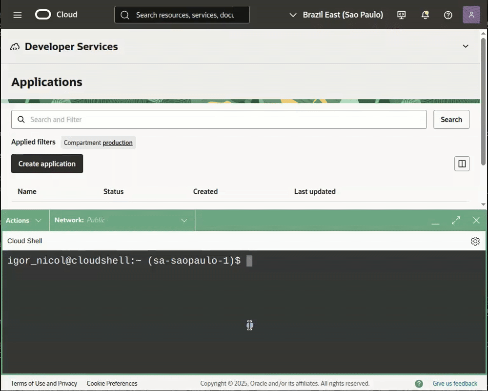

<h1> OCI Function: FinOps - Focus Report Extractor </h1>

[Veja esse README em Portugues](./readme.md) <span>&#x1f1e7;&#x1f1f7;</span>

This set of files contains a ***Function*** in Python designed to automate the process of *downloading* and *uploading* reports in the [**FOCUS**](https://focus.finops.org/) standard from your *Tenancy* OCI to a *bucket* within the same *tenancy*.

<h2> Disclaimer </h2>

Before proceeding, it is essential to bear in mind that the use of any *scripts*, codes or commands contained in this repository is at your own risk. The authors of the codes are not responsible for any charges arising from the use of the content provided here.

**We recommend testing all the content in an appropriate environment and integrating the automation *scripts* into a robust monitoring infrastructure in order to keep track of how the process is working and mitigate possible failures.

This project is **not an official Oracle application** and therefore has no formal support. Oracle is not responsible for any content herein.

<h2>Overview</h2>

The *script* in Python, developed to run on the *serverless* **OCI Functions** service, *downloads* the reports in **FOCUS** format directly from OCI's public *bucket*. The process includes the collection of all available files and the subsequent *upload* of all files that are not present in the destination *bucket*.

The storage structure at the destination replicates the hierarchy at the source: **Year/Month/Day**.

This entire operation is orchestrated via direct calls to the OCI API, as detailed below:

- [**Object Storage**: `get_namespace`](https://docs.oracle.com/en-us/iaas/tools/python/latest/api/object_storage/client/oci.object_storage.ObjectStorageClient.html#oci.object_storage.ObjectStorageClient.get_namespace)
- [**Object Storage**: `list_objects`](https://docs.oracle.com/en-us/iaas/tools/python/latest/api/object_storage/client/oci.object_storage.ObjectStorageClient.html#oci.object_storage.ObjectStorageClient.list_objects)
- [**Object Storage**: `copy_object`](https://docs.oracle.com/en-us/iaas/tools/python/latest/api/object_storage/client/oci.object_storage.ObjectStorageClient.html#oci.object_storage.ObjectStorageClient.copy_object)

<h2>Index</h2>

- [Requirements](#requirements)
  - [Permissions](#permissions)
  - [Networking](#networking)
- [Project files](#project-files)
- [Cloud Shell](#cloud-shell)
  - [Architecture X86\_64](#architecture-x86_64)
  - [Environment variables](#environment-variables)
- [Work Directory](#work-directory)
- [Clone the Git repository](#clone-the-git-repository)
- [OCI Container Registry](#oci-container-registry)
- [Bucket](#bucket)
- [OCI Function](#oci-function)
  - [OCI Function: Application](#oci-function-application)
  - [OCI Function: Context](#oci-function-context)
  - [OCI Function: Files](#oci-function-files)
    - [requirements.txt](#requirementstxt)
    - [func.yaml](#funcyaml)
    - [func.py](#funcpy)
  - [OCI Function: Build](#oci-function-build)
  - [OCI Function: Tagging](#oci-function-tagging)
  - [OCI Function: Dynamic Group](#oci-function-dynamic-group)
  - [OCI Function: Policy](#oci-function-policy)
- [Resource Scheduler](#resource-scheduler)
  - [Resource Scheduler: Dynamic Scheduling](#resource-scheduler-dynamic-scheduling)
  - [Resource Scheduler: Dynamic Group](#resource-scheduler-dynamic-group)
  - [Resource Scheduler: Policy](#resource-scheduler-policy)
  - [Resource Scheduler: Using existing scheduling](#resource-scheduler-using-existing-scheduling)
- [Testing](#testing)
- [Logging](#logging)

## Requirements

In order to continue with this procedure, the following **requirements** must be met:

### Permissions

Permissions are divided into two groups of actions:

- **For Resource Creation:**
  - Bucket
  - Dynamic Group
  - IAM Policy
  - Function
  - OCI Container Registry
  - Resource Scheduler

- For Resource Access
  - Cloud Shell
  - Cost and Usage Reports

### Networking

It is mandatory that you have a **VCN** created with a **Subnet** that has IP addresses available to allocate the *Function*. This Subnet must have Internet access or have an active Service Gateway.

## Project files

The following are the files that make up the project. Only one file is essential; `readme.md` and `readme_en-US.md` can be ignored during the deployment process.

```BASH
.
├── func.py
├── readme.md
└── readme_en-US.md
```

| Item | Descrição |
|------|-----------|
|**func.py**    |The Python *script* that will be executed by the *function*.|
|readme.md      |This documentation and help file.|
|readme_en-US.md|English version of this documentation and help file.|

## Cloud Shell

To start creating and configuring resources, **open the Cloud Shell**.


### Architecture X86\_64

For the correct operation of the resources involved in this procedure, we will use the **x86\_64** architecture by default.


**Validate the architecture with the command below. The expected return is “x86\_64:OK” for the correct configuration.

```BASH
[ "$(uname -m)" == "x86_64" ] && echo "$(uname -m):OK" || echo "$(uname -m):ERRO"
```

### Environment variables

Before creating the environment variables, check that they have all been configured correctly.

```BASH
export FN_APP_NAME="FinOps"
export FN_FUNC_NAME="Focus-Report-Extractor"
export FN_FUNC_TAG_VALUE='Scheduled-Function'
export OCI_DOMAIN_NAME='Default'
export OCI_USERNAME='user.name@domain.com'
export OCI_BUCKET_NAME_DESTINATION="FinOps-Billing-Report"
export OCI_COMPARTMENT="ocid1.compartment.oc1..aaaaaaaa7_____1604"
export OCI_SUBNET='ocid1.subnet.oc1.<region>.aaaaaaaau_____1604'
export OCI_REPO_NAME="${FN_APP_NAME,,}_${FN_FUNC_NAME,,}"
export OCI_NAMESPACE=$(oci os ns get --raw-output --query 'data')
export OCI_BUCKET_ROOT_PATH='FOCUS-Reports'

set|grep -E '^(FN_APP_NAME|FN_FUNC_NAME|FN_FUNC_TAG_VALUE|OCI_DOMAIN_NAME|OCI_USERNAME|OCI_BUCKET_NAME_DESTINATION|OCI_COMPARTMENT|OCI_SUBNET|OCI_REPO_NAME|OCI_NAMESPACE|OCI_BUCKET_ROOT_PATH|OCI_REGION|OCI_TENANCY)'
```

| Variable | Description |
|-|-|
|**FN_APP_NAME**                |Name of the Application where the functions will be created.|
|**FN_FUNC_NAME**               |Name of the **OCI Function**.|
|**FN_FUNC_TAG_VALUE**          |Value used to identify the function that will be executed by the *Resource Scheduler*. The Key of the *free-form Tag* will be the name of the Function Application, defined in the variable **FN_APP_NAME**.|
|**OCI_DOMAIN_NAME**            |Name of the domain in which the user used was created.|
|**OCI_USERNAME**               |Name of the user to be used for authentication in the **OCI Registry**. This user will only be used during the configuration process.|
|**OCI_BUCKET_NAME_DESTINATION**|Name of the **Bucket** that will be used to store the files extracted by the **OCI Function**.|
|**OCI_COMPARTMENT**            |OCID (*Oracle Cloud Identifier*) of the ***compartment** where all the resources (Function Application, OCI Function, OCI Registry, etc.) will be created. |
|**OCI_SUBNET**                 |OCID (*Oracle Cloud Identifier*) of the ***subnet*** in which the *function* will be created.|
|**OCI_REPO_NAME**              |Name of the repository in the **OCI Registry** to store the *images* of the *function*. |
|**OCI_NAMESPACE**              |Name of the **namespace* of the **Object Storage** of Tenancy.|
|**OCI_BUCKET_ROOT_PATH**       |Name of the **root directory** of the destination bucket for the files extracted by the **OCI Function**.|

In addition to these, other variables will be used that are already previously defined in the OCI Cloud Shell:

| Variable | Description |
|-|-|
| **OCI_REGION** |Full name of the region to which the OCI Cloud Shell is connected.|
| **OCI_TENANCY** |OCID (*Oracle Cloud Identifier*) of the OCI Tenancy to which we are logged into the OCI Cloud Shell.|

## Work Directory

Let's **create a working directory** to organize all our files and then start **creating the necessary artifacts** and *building* our *function*.

```BASH
mkdir -p ~/oci-functions/${FN_FUNC_NAME,,}
cd ~/oci-functions/${FN_FUNC_NAME,,}
```

## Clone the Git repository

Clone this git repository and/or make all the files mentioned in the [Project files](#project-files) topic available in our working directory.

```BASH
git clone https://github.com/wuilber002/oci-functions.git
```

## OCI Container Registry

It is necessary to use an **Auth Token as a password** during the *login* process in the **OCI Container Registry**.

If you do not have an *Auth Token* created, generate a new one using the following command:

```BASH
oci iam auth-token create \
--user-id ${OCI_CS_USER_OCID} \
--description "OCI Container Registry" \
--raw-output \
--query 'data.token'
```

This is the command to *login* to the **OCI Container Registry**:

> [!TIP]
> If you have just created the **Auth Token**, **wait a few minutes** before using it. It may take a while for the token to be propagated and ready to *login* to the OCI Container Registry.

```BASH
docker login -u "${OCI_NAMESPACE}/${OCI_DOMAIN_NAME}/${OCI_USERNAME}" ${OCI_REGION}.ocir.io
```

## Bucket

This *Bucket* will receive all the **FOCUS reports** extracted for the *Tenancy*.

If you already have a *Bucket* created, you can skip this part and export the **OCI_BUCKET_NAME_DESTINATION** variable with the name of your bucket. Otherwise, create the bucket with the command below:

```BASH
oci os bucket create --name ${OCI_BUCKET_NAME_DESTINATION} \
--storage-tier "STANDARD" \
--namespace-name ${OCI_NAMESPACE} \
--compartment-id ${OCI_COMPARTMENT}
```

## OCI Function

### OCI Function: Application

Create a **FN Application** with x86\_64 architecture to host the *function*. If you already have one, *export* the OCID (*Oracle Cloud Identifier*) to the environment variable ***FN_APP_OCID*** and the name to ***FN_APP_NAME*** to make it easier to use later.

To create the *application*, use the command below, which already exports the OCID (*Oracle Cloud Identifier*) to an environment variable.

```BASH
export FN_APP_OCID=$(oci fn application create \
--display-name ${FN_APP_NAME} \
--compartment-id ${OCI_COMPARTMENT} \
--subnet-ids "[\"${OCI_SUBNET}\"]" \
--shape "GENERIC_X86" \
--raw-output \
--query 'data.id')

set | grep -E '^(FN_APP_OCID)'
```

### OCI Function: Context

It is necessary to make some **context settings** for the OCI Functions `fn` client.

```BASH
fn use context ${OCI_REGION}
fn update context oracle.compartment-id ${OCI_COMPARTMENT}
fn update context registry ${OCI_REGION}.ocir.io/${OCI_NAMESPACE}/${OCI_REPO_NAME}
fn update context oracle.image-compartment-id ${OCI_COMPARTMENT}
fn list context
```

### OCI Function: Files

You need to have the following files in your Cloud Shell working directory.

- `requirements.txt`
- `func.yaml`
- `func.py`

To create the `func.yaml` and `requirements.txt` files, you must use the commands below:

#### requirements.txt

This file contains the list of Python modules needed to execute the *script* `func.py`.

```BASH
cat << EOF > requirements.txt
oci>=2.155
fdk
EOF
```

#### func.yaml

Metadata file with the configuration and characteristics of the *function* to be created.

```BASH
cat << EOF > func.yaml
schema_version: 20180708
name: ${FN_FUNC_NAME,,}
version: 0.0.1
runtime: python
entrypoint: /python/bin/fdk /function/func.py handler
memory: 128
timeout: 300
config:
 OCI_BUCKET_DESTINATION: ${OCI_BUCKET_NAME_DESTINATION}
 OCI_TENANCY_OCID: ${OCI_TENANCY}
 OCI_BUCKET_ROOT_PATH: ${OCI_BUCKET_ROOT_PATH}
EOF
```

To ensure the flexibility of the solution, the *function* will use **variables** to receive data that can vary in each *tenancy*. Below is a description of each variable:

| Variable              | Description |
|-----------------------|--------------------|
|OCI_BUCKET_DESTINATION |Name of the *Bucket* that will be used to **store the files extracted by the OCI Function**.|
|OCI_TENANCY_OCID       |The **OCID** (*Oracle Cloud Identifier*) of the *Tenancy*.|
|OCI_BUCKET_ROOT_PATH   |Name of the "root" folder located in the "Bucket" that will receive the files extracted by the OCI Function.|

#### func.py

The `func.py` file needs to be uploaded (via *upload*) if you haven't cloned the repository to our *work directory*.



After uploading using the button in the top right corner, move the file to the **work directory** you created earlier.

```BASH
mv ~/func.py .
```

### OCI Function: Build

The next command will perform the following steps:

- Creates the *image* of the *function* with Python and all the modules listed in `requirements.txt`;
- Creates the repository in the **OCI Container Registry** for the *upload* of the *image*;
- Creates the *function* with the characteristics defined in `func.yaml` within the **Function Application**;
- Configures the environment variables.

```BASH
fn --verbose deploy --app "${FN_APP_NAME}"
```

After successfully *building* and *deploying* the *image* of the *function*, it is necessary to **obtain the OCID** (*Oracle Cloud Identifier*) of the *function* in order to release its access to the necessary resources.

Run the command below to find out the OCID (Oracle Cloud Identifier) of the function:

```BASH
export FN_FUNC_OCID=$(oci fn function list \
--application-id ${FN_APP_OCID} \
--raw-output \
--query "data[?contains(\"display-name\", '${FN_FUNC_NAME,,}')].id | [0]")

set | grep -E '^(FN_FUNC_OCID)'
```

### OCI Function: Tagging

In order for the **Resource Scheduler** service to be able to identify and select the correct resource for scheduled execution, it is necessary to **define the specific Free-form Tag** in the *function* created.

The *Resource Scheduler* will use this *tag* as a metadata filter to invoke the resource.

Use the following command to apply the *tag* to the *function*:

```BASH
oci fn function update \
--force \
--function-id ${FN_FUNC_OCID} \
--freeform-tags "{\"${FN_APP_NAME}\": \"${FN_FUNC_TAG_VALUE}\"}"
```

### OCI Function: Dynamic Group

In order to grant the necessary permissions for the *function* to access the FOCUS reports and the target *bucket*, it is essential to create a **Dynamic Group**, according to the command below:

```BASH
export DYG_FUNCTION="${FN_APP_NAME}_${FN_FUNC_NAME}"

oci iam dynamic-group create \
--name ${DYG_FUNCTION} \
--description "Dynamic group for the function that extracts the FOCUS reports from billing." \
--matching-rule "ALL {resource.type = 'fnfunc', resource.id = '${FN_FUNC_OCID}'}"
```

> [!NOTE]
The **`matching-rule`` of this **Dynamic Group** will exclusively select its *function*, regardless of the *compartment* of creation.

### OCI Function: Policy

This access policy will grant the *function* permission to access FOCUS reports and the target *bucket*, using the dynamic group created.

```BASH
cat <<EOF > /tmp/function_focus_report_extractor.policy
[
    "DEFINE TENANCY usage-report AS ocid1.tenancy.oc1..aaaaaaaaned4fkpkisbwjlr56u7cj63lf3wffbilvqknstgtvzub7vhqkggq",
    "ENDORSE DYNAMIC-GROUP ${DYG_FUNCTION} TO READ objects IN TENANCY usage-report",
    "ALLOW DYNAMIC-GROUP ${DYG_FUNCTION} TO READ buckets IN COMPARTMENT ID ${OCI_COMPARTMENT} WHERE ALL {target.bucket.name='${OCI_BUCKET_NAME_DESTINATION}'}",
    "ALLOW DYNAMIC-GROUP ${DYG_FUNCTION} {OBJECT_INSPECT} IN COMPARTMENT ID ${OCI_COMPARTMENT} WHERE ALL {target.bucket.name='${OCI_BUCKET_NAME_DESTINATION}'}",
    "ALLOW DYNAMIC-GROUP ${DYG_FUNCTION} TO MANAGE objects IN COMPARTMENT ID ${OCI_COMPARTMENT} WHERE ALL {target.bucket.name='${OCI_BUCKET_NAME_DESTINATION}',target.object.name='${OCI_BUCKET_ROOT_PATH}/*'}",
]
EOF

oci iam policy create \
--name "${FN_APP_NAME}_${FN_FUNC_NAME}" \
--description "Permissions for the function that extracts the FOCUS reports from billing." \
--compartment-id ${OCI_TENANCY} \
--statements file:///tmp/function_focus_report_extractor.policy
```

> [!IMPORTANT]
Because it contains an [**`endorse`**](https://docs.oracle.com/en-us/iaas/database-tools/doc/cross-tenancy-policies.html) rule, this policy must be created in the *root* **compartment** (**Tenancy**) of the environment.

## Resource Scheduler

For automated execution, we will use OCI's **Resource Scheduler** PaaS service.

> NOTE:
If you have a pre-existing schedule that you want to reuse, please proceed to the topic: [Resource Scheduler: Using existing scheduling](#resource-scheduler-using-existing-scheduling)

---

The schedule to be created will be of the **dynamic** type, configured for **a daily run** at the following time:

- **00:00 UTC** (Midnight).

It is essential to note that the schedule is parameterized in the **UTC** (*Coordinated Universal Time**) time zone. For regions with an offset (e.g. **-3 hours** from UTC, such as the time zone of São Paulo, Brazil), the execution times must be adjusted as necessary.

### Resource Scheduler: Dynamic Scheduling

A dynamic schedule selects the resources to be executed at the time of the invocation, based on previously defined filter criteria. We will adopt the following criteria:

- **Compartment:** Reside in the **Compartment** defined by the `OCI_COMPARTMENT` environment variable.
- **Free-form Tag:** Has the **Free-form Tag** with the exact key and value: `FinOps: Scheduled-Function`.
- Resource Type:** Be a resource of type **Function** (OCI Function).

Based on the criteria listed, we will create the **Resource Filter** JSON file, which will be used to identify the resources that will have their execution scheduled.

```BASH
cat <<EOF > /tmp/resource_scheduler-resource_filter.policy
[
  {
    "attribute": "RESOURCE_TYPE",
    "value": [
      "FunctionsFunction"
    ]
  },
  {
    "attribute": "COMPARTMENT_ID",
    "should-include-child-compartments": null,
    "value": "${OCI_COMPARTMENT}"
  },
  {
    "attribute": "DEFINED_TAGS",
    "value": [
      {
        "namespace": "FREEFORM_TAG",
        "tag-key": "${FN_APP_NAME}",
        "value": "${FN_FUNC_TAG_VALUE}"
      }
    ]
  }
]
EOF
```

And then the command to **create the execution schedule**:

```BASH
export CRON_SCHEDULER="3"

export RESOURCE_SCHEDULER_OCID=$(oci resource-scheduler schedule create \
--display-name "${FN_APP_NAME} - Functions Scheduler" \
--description "Scheduling the execution of FinOps process functions." \
--compartment-id ${OCI_COMPARTMENT} \
--action "START_RESOURCE" \
--recurrence-details "0 ${CRON_SCHEDULER} * * *" \
--recurrence-type "CRON" \
--resource-filters file:///tmp/resource_scheduler-resource_filter.policy \
--raw-output \
--query 'data.id')

set | grep -E '^(RESOURCE_SCHEDULER_OCID)'
```

### Resource Scheduler: Dynamic Group

Similarly to the *Function*, it is necessary to create a **Dynamic Group** specific to our schedule, according to the command below:

```BASH
export DYG_RESOURCE_SCHEDULER="${FN_APP_NAME}-Functions_Scheduler"

oci iam dynamic-group create \
--name "${DYG_RESOURCE_SCHEDULER}" \
--description "Dynamic group for the Resource Scheduler that will run the function that extracts the Cloud Advisor recommendations." \
--matching-rule "All {resource.type='resourceschedule', resource.id='${RESOURCE_SCHEDULER_OCID}'}"
```

> [!NOTE]
The **matching-rule** of this *Dynamic Group* will exclusively select our schedule, regardless of the compartment where it was created.

### Resource Scheduler: Policy

This access policy will grant the scheduler permission to **invoke our *function**, using the dynamic group that will be created.

```BASH
oci iam policy create \
--name "${FN_APP_NAME}-Functions_Scheduler" \
--description "Permissions to invoke functions from a specific compartment of the FinOps project." \
--compartment-id ${OCI_COMPARTMENT} \
--statements "[\"Allow dynamic-group ${DYG_RESOURCE_SCHEDULER} to use functions-family IN COMPARTMENT ID ${OCI_COMPARTMENT}\"]"
```

> [!IMPORTANT]
The access policy will be created in the same *compartment* as all the other resources, as defined by the `OCI_COMPARTMENT` variable.

### Resource Scheduler: Using existing scheduling

If you have created a schedule following any of the procedures in this GitHub project, **no further action is required** for this *function* to run. The schedule created in the **Resource Scheduler** is configured as **dynamic** and will run all the *functions* that meet the following criteria:

- **Compartment:** Residing in the same **Compartment** defined when the schedule was created.
- **Free-form Tag:** Have the **Free-form Tag** `FinOps: Scheduled-Function`.
- **Resource Type:** Be a **Function** type resource.

---

If your scenario is different and you want to use a pre-existing schedule that is not of the dynamic type, you can follow the procedure below:

Navigate through the console to the **Resource Scheduler** service (MENU > Governance & Administration > Resource Scheduler) and find the previously created schedule to which you want to add the function and edit it as shown below:


## Testing

> [!TIP]
After successfully completing the creation process, **take a few minutes break**. This pause is crucial to ensure that the system loads and updates the permissions *caches*, especially the new policies granted to the OCI Function and the OCI Resource Scheduler.

To **check the functioning** of the *function*, use the command below:

```BASH
fn invoke ${FN_APP_NAME} ${FN_FUNC_NAME,,}
```

This command **invokes the *function** and returns the execution data. The expected result is similar to this:

```JSON
{
  "time": 0.7955700970001089,
  "orig": 1604,
  "dest": 1604,
  "copy": 0,
  "erro": 0
}
```

|item|description|
|----|---------|
|time|**Total execution time** of the *script*, in seconds.|
|orig|**Quantity of files** found in the source.|
|dest|**Quantity of files** already in the destination *bucket*.|
|copy|**Quantity of new files** successfully copied to the destination *bucket*.|
|error|**Quantity of files** that had an error during the copy to the destination *bucket*.|

## Logging

If problems or errors occur, **read the *log** and follow the events to identify and correct any faults.

In this *link*, [Oracle Cloud: Problems invoking functions](https://docs.oracle.com/en-us/iaas/Content/Functions/Tasks/functionstroubleshooting_topic-Issues-invoking-functions.htm), you will find several **known problems** and possible **solutions** for each scenario.

> [!IMPORTANT]
The ***Function Log* is not enabled by default**. If necessary, you need to activate it manually.
